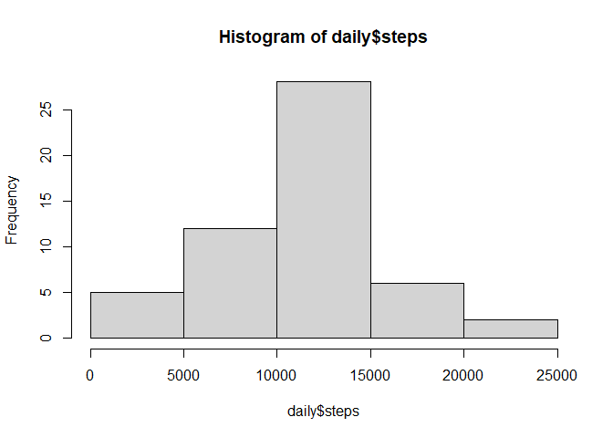
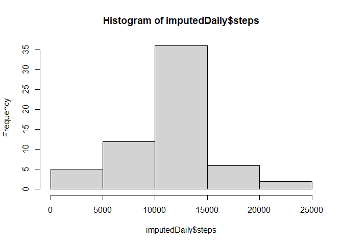
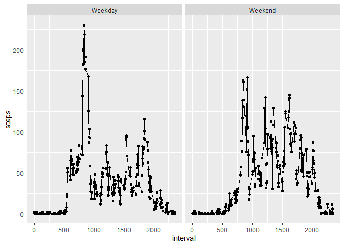

## Loading and preprocessing the data

```r
unzip("H:/My Drive/RWD/Reproducible/RepData_PeerAssessment1/activity.zip")
data <- read.csv("activity.csv")
```

## What is mean total number of steps taken per day?

```r
library(dplyr)
```

```
## 
## Attaching package: 'dplyr'
```

```
## The following objects are masked from 'package:stats':
## 
##     filter, lag
```

```
## The following objects are masked from 'package:base':
## 
##     intersect, setdiff, setequal, union
```

```r
daily <- data %>% group_by(date) %>%
  summarize(steps=sum(steps))
hist(daily$steps)
```

<!-- -->

```r
StepsMean <- mean(daily$steps, na.rm=TRUE)
StepsMedian <- median(daily$steps, na.rm=TRUE)
print(paste("Mean number of daily steps:", StepsMean, "; Median number of daily steps:", StepsMedian))
```

[1] "Mean number of daily steps: 10766.1886792453 ; Median number of daily steps: 10765"

## What is the average daily activity pattern?

```r
timely <- data %>% group_by(interval) %>%
  summarize(steps=mean(steps, na.rm = TRUE))
with(timely, plot(interval, steps, type="l"))
```

<!-- -->

```r
max_interval <- with(timely, interval[which.max(steps)])
print(paste("5-minute interval with maximum number of steps on average across all the days:", max_interval))
```

[1] "5-minute interval with maximum number of steps on average across all the days: 835"

## Imputing missing values

```r
print(paste("Total number of missing values: ", sum(is.na(data$steps))))
```

[1] "Total number of missing values:  2304"

```r
imputedData <- data
imputedData$steps <- rowSums(cbind(data$steps, is.na(data$steps) * timely$steps), na.rm=TRUE)
imputedDaily <- imputedData %>% group_by(date) %>%
  summarize(steps=sum(steps))
hist(imputedDaily$steps)
```

<!-- -->

```r
imputedStepsMean <- mean(imputedDaily$steps, na.rm=TRUE)
imputedStepsMedian <- median(imputedDaily$steps, na.rm=TRUE)
print(paste("After imputation, mean number of daily steps:", imputedStepsMean, ", and median number of daily steps:", imputedStepsMedian))
```

[1] "After imputation, mean number of daily steps: 10766.1886792453 , and median number of daily steps: 10766.1886792453"

## Are there differences in activity patterns between weekdays and weekends?

```r
library(ggplot2)
imputedData$weekday <- ifelse(weekdays(as.Date(imputedData$date)) %in% c("Saturday", "Sunday"), "Weekend", "Weekday")
timely <- imputedData %>% group_by(interval, weekday) %>%
  summarize(steps=mean(steps, na.rm = TRUE))
```

```
## `summarise()` has grouped output by 'interval'. You can override using the
## `.groups` argument.
```

```r
ggplot(timely, aes(x = interval, y = steps)) +
  geom_point(show.legend = FALSE) +
  geom_line()+
  facet_wrap(~weekday)
```

<!-- -->
